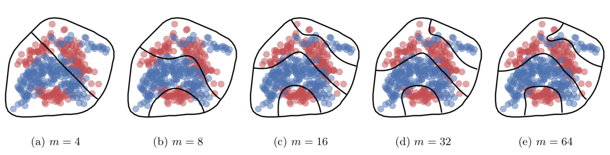

# Know Your Boundaries: Constraining Gaussian Processes by Variational Harmonic Features

[Arno Solin](http://arno.solin.fi) · [Manon Kok](https://sites.google.com/site/manonkok2/home)

Codes for the paper:

* Arno Solin and Manon Kok (2019). **Know your boundaries: Constraining Gaussian processes by variational harmonic features.** In *Proceedings of the 22nd International Conference on Artificial Intelligence and Statistics (AISTATS)*. Naha, Okinawa, Japan. [[arXiv]](https://arxiv.org/abs/1904.05207) [[poster]](https://users.aalto.fi/~asolin/documents/pdf/Solin-Kok-2019-AISTATS-poster.pdf)


*The effect of increasing the number of inducing features for the banana classification dataset with a hard decision boundary. In each pane, the coloured points represent training data and the decision boundaries are black lines. The outermost line is the pre-defined hard decision boundary.*

## Summary

We consider constraining GPs to arbitrarily-shaped domains with boundary conditions. We solve a Fourier-like generalised harmonic feature representation of the GP prior in the domain of interest, which both constrains the GP and attains a low-rank representation that is used for speeding up inference. The method scales as O(nm^2) in prediction and O(m^3) in hyperparameter learning for regression, where n is the number of data points and m the number of features. Furthermore, we make use of the variational approach to allow the method to deal with non-Gaussian likelihoods. This repository contains the Matlab codes for constructing the basis functions in arbitrarily-shaped domains, code for simulating constrained GP random draws, and code for solving GP regression. We also provide code in Python for for constructing the basis functions in arbitrarily-shaped domains and doing variational inference for non-Gaussian likelihoods.

## Matlab

The Matlab methods are implemented in a rather standalone fashion. The codes have been tested in Mathworks Matlab R2018b with a rich set of standard Mathworks toolboxes installed.

There are some examples in the `experiments` directory that give some intuition how to run the methods.

## Python

We provide an overlapping (but not equal) implementation of the methods in Python. The constructions of the domain basis functions is considerably slower in Python than in Matlab. This is due to lazy coding, so the Python implementation should be seen as proof-of-concept. The variational inference for non-Gaussian likelihood requires GPflow to be installed. We also leverage matrix operations which are from [VFF](https://github.com/jameshensman/VFF).

There are some examples in the `experiments` directory that give some intuition how to run the methods.

### Install

The boundary GP Python codes for non-Gaussian likelihoods relies heavily on [GPflow](github.com/GPflow/GPflow). After installing GPflow, clone this repo and add the `DGP` directory to your `PYTHONPATH`. For example, to make sure you can run the Jupiter notebook examples, consider doing this:

```bash
export PYTHONPATH="${PYTHONPATH}:/path/to/codes/python"
```

## License

Copyright 2018-2019 Manon Kok and Arno Solin

Licensed under the Apache License, Version 2.0 (the "License");
you may not use this file except in compliance with the License.
You may obtain a copy of the License at

http://www.apache.org/licenses/LICENSE-2.0

Unless required by applicable law or agreed to in writing, software
distributed under the License is distributed on an "AS IS" BASIS,
WITHOUT WARRANTIES OR CONDITIONS OF ANY KIND, either express or implied.
See the License for the specific language governing permissions and
limitations under the License.
